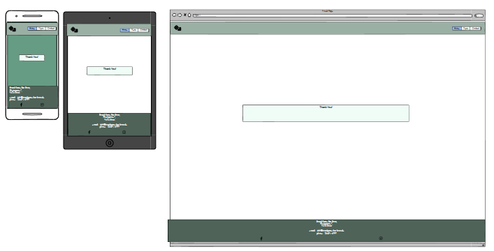
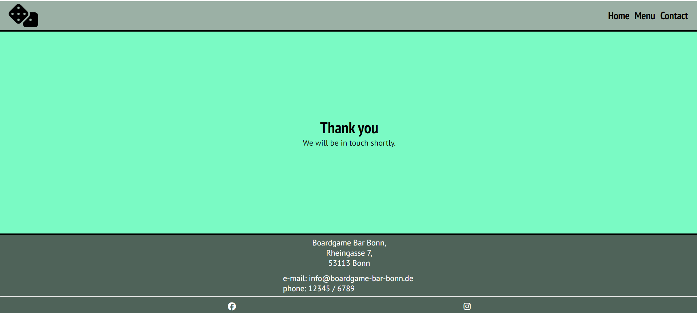

# ReadME - Project Intructution
Portfolio Project 1 – User SureDeveloping – Code Institute

## Contents 
[Contens](#contens) \
[User Experience (UX)](#user-experience)\
[Initial Situation](#initial-situation) \
[User Story](#user-story)\
[Design](#design) \
[Color Scheme](#color-scheme) \
[Typography](#typography) \
[Imagery](#imagery) \
[Wireframe](#wireframe) \
[Features](#features) \
[Accessibility](#accessibility) \
[Technologies Used](#technologies-used) \
[Software and frameworks Used](#software-and-frameworks-used) \
[Languages Used](#languages-used) \
[Deployment](#deployment) \
[Testing](#testing) \
[Manual Testing](#manual-testing) \
[Chrom Developer Tools](#chrom-developer-tools) \
[Slack peer groupe rewiew](#slack-peer-groupe-rewiew) \
[W3C Validator](#w3c-validator) \
[Solved Bugs](#solved-bugs) \
[Known unsolved Bugs](#known-unsolved-bugs) \
[Credits](#credits) \
[Code Used](#code-used) \
[Content on the website](#content-on-the-website) \
[Learning Materials](#learning-materials) \
[Acknowledgments](#acknowledgments)

## User Experience (UX)
### Initial Situation
I was hired by the operator of the Boardgame Bar Bonn to create a website for their bar. The bar has a new concept that is currently unique in Bonn and is not yet known to many people. The bar has a large collection of games available for guests to borrow and play. The Boardgame Bar Bonn aims to become a permanent meeting place for all board game lovers and fans in Bonn and the surrounding area. It wants to create an incentive to try out new games and make new contacts with like-minded people.

The bar only opened 3 months ago. The website is an important means for the bar to become better known and to attract attention. It offers all the necessary information at a glance and distributes all information to both regular customers and interested parties.

Visitors to the site are board game enthusiasts aged between 10 and 70. There are also games for younger people in the bar. It is assumed that they will visit the bar accompanied by an adult and will therefore not inform themselves.

The website should provide guests with all the important information about the bar so that they can plan their visit. It makes work easier for operators and staff because the same questions that keep coming up are no longer necessary. At the same time, the website increases awareness of the bar and contributes to customer loyalty by providing up-to-date information.

The most important information is therefore the concept of the bar, opening hours, address, contact details, news and the menus.

### User Story
#### The goal of the Boardgame Bar Bonn as operator:
- They want more customers to come to the bar. Accordingly, information about the opening hours, address, contact options, the bar concept and the menu should be represented on the website.
- They want to inform your regular customers about games or offers via the website.
- They want the website to be easily accessible for all users and to work on any device.
- They want to offer customers a way to enter to reserve a seat.
- They want the site to be usable by everyone.
- They want more that the links to the social media channels are easy to find to get more followers.

#### The Goal of a first-time visitor to the website:
- Would like to know what concept the bar has.
- Wants to know where the bar is located.
- Wants to know when it is open.
- Wants to know what food and drinks are available there.
- Would like to know what games are available.
- Would like to know how much it costs to play there.
- Would like to be able to contact the bar for questions.
- Would like links to the bar's social media.

#### Goal of second first-time visitor to the website
- Would like to see the address and opening hours again to plan his visit.
- Would like to make contact to reserve a table.
- Would like to subscribe to the newsletter.

#### Frequent Visitor Goals
- Would like to know what news there is. Offers or new games.
- Would like to make contact to reserve a table.

## Design
### Color Scheme
In consultation with the customer, the colors were based on the colors of the locale. Bright, friendly shades were chosen there. I used the website https://mycolor.space/ to find other matching colors for the base color.

 

Finally, I checked the contrast again with the page https://contrast-grid.eightshapes.com/

### Typography
The fonts come from Googlefonds and were used for the following fonts:
- PT Sans Narrow is used for headings on the site. It is a sans-serif font.
- PT Sans is used for the body text on the site. It is a sans-serif font.

### Imagery
Images used are from the site https://www.freepik.com/

### Wireframe
At the beginning I had planned a website with 5 pages: Home, News, Menu and Contact and an additional "thanks page" as response for the contact form. But I realized that this is too much for a first project. Therefore the news page will come later in the first update. News are still shown on the landing page to serve the need to provide News of the Bar to the visiter.

I also planned the website with too many pictures and detailed information. Therefore the Homepage has been redesigned. The menu page stayed almost the same. There i did not do a new wireframe for that page.

Here are the Wireframes:

Old Wireframe for the homepage:  
  
Old Wireframe for the news page:  
  
New Wireframe for the homepage:  
  
Wireframe for the menu page:  
  
Wireframe for the contact page:  
  
Wireframe for the thanks page:  
  

### Features
The website is planned as a multi-page project. These pages can be accessed via the navigation menu. There are the Home, Menu and Contat pages. 
In addition, a thank you page has been created for sending a message, after the user has filled and sended in the contact form.
- Feature of all pages:
    - The header with a navigation bar is positioned in the top right corner. This navigation bar can be used to navigate the page. To the left is an icon of a pair of dice, matching the boardgames theme. The cube also has a link that leads to the homepage

    - In addition, the footer is the same on all pages. The footer contains the address of the bar and the social media icon with links to instergram and facebook.

- Home Page 
    - Below the header is a background image with a view of the bar. On the picture you can read the words "Welcome at the BBB Boardgame Bar Bonn".
    - The first section of the page is an about section that briefly explains the bar and the concept.
    - Followed by a section which draws attention to the news. There is a link which brings you to the menu page and an external link brings you to a list of all boardgames.
    - The 4rd section is an explanation of how to "plan your first visit". It is a 4 steps guide. Icons have been used here to lighten up the presentation, matching the points that are explained. The menu page is linked, the opening hours section and an external link to the game collection is used.
    - The 5 section has information about the fees for playing a boardgame in the bar. 
    - The 6 section is the opening hours of the bar
    - The 7 section is directions on how to find the bar with an embedded googlemaps map.
  
  

- Menu Page:
    - On the Menu page, is a hero image with a headline "Boardgame Bar Bonn Menu". The menu page has 2 sections. The 1st section contains all drinks. Here are 3 lists divided into hot drinks, cold drinks and alcoholic drinks. The 2nd section contains the dishes on offer. These are divided into the 4 categories Burger, Fingerfood, Sancks and Dips
  

- Contact Page.
    - On the contact page there is a form in which you can enter your name, first name, e-mail address and telephone number. The phone number is optional. The other fields are mandatory. 
    - Below this are radio buttons where you have to select the reason for the message. There is a choice. Reservation, Question Subscribe to newsletter, Request for a callback. This allows the messages to be pre-sorted by topic. This is followed by a text input field. With a send button underneath. After Sending the Message the user will get a response.
      

- Thank You Page.
    - Thank you message for send a text via the contact form. "Thank you We will be in touch shortly" is written in the middel of the side.
      

- Future Implementations.
    - At first I had planned to create seperate news page. This should be be realized in the future. 
    - There should be more detailed pictures of the bar with the individual rooms in a page with the title "Our premises". These pictures will be taken by a professional photographer and were not yet available at the start of the project. There will also be a 3D tour of the bar so that customers can get a better impression before their visit. 
    - A booking system is to be added where tables and seats can be booked and reserved online. This will make the staff's work easier and offer more convenience for guests, as they will receive a direct response and will not have to wait for feedback. At the same time, a member area is created. Java script and a backend are required for this.
    - The games are recorded in a separate database and guests can search for specific categories and have new games suggested to them. The games can also be loaned out for a limited period of time so that guests can play the games at home. All games in the game library are to be presented in course presentations. In addition, the rules should be explained in a video which is linked to the database entry. These instructions will be linked to the games in the store via a QR code. The guest can therefore also scan the QR code in the store and watch the instructions and video.
    - The belly system is also to be extended to the games. These should also be able to be reserved later for an additional charge. At the same time, it will be possible to determine which games are the most popular. These games can then be played several times and a ranking of the most played games can be published on the website. 
    - If guests would like to purchase the games themselves in order to own one, an online store for board games is also planned to be linked to the website.

### Accessibility
To ensure Accessibility the following things were done:
- I used semantic HTML
- I used descriptive alt attributes for images
- I provided information for screen readers
- I used good color contrast and a tested color palette

## Technologies Used
### Languages Used
HTML and CSS were used for this project.

### Software and frameworks Used
Balsamiq - To create a wireframe \
Gitpod - To code the website \
Git - For version control \
Github - To store and deploy the website \
Google Fonts - All fonts used are from google fonts \
Font Awesome - All icons used are from Font Awesome \
gauger.io/fonticon - To create a favicon
Google Dev Tools, and Lighthouse - For troubleshooting, testing and fixing bugs \
Deepl - For translating text \
ChatGPT3.5 - For summarizing self-written text content \
Birme To change the image to webp format \
Am I Responsive? To check if the page is responsive \ 

## Deployment
The project was codes with gipod and then deployed on Github. That is how the deployment was done:
 - I loged in at GitHub and navtigate to the repo of the project
 - I clicked on Settings and navigated to "Github pages"
 - There I seted the source of Deploy from a branch and set the branch from none to main and clicked save.
 - Then this link was deployed automatically: https://suredeveloping.github.io/Boardgame-Bar-Bonn/

## Testing
The page was tested on different ways and different errors came to light.

### Manual Testing:
 I tested all the links and the Form. This was done during the hole prozess. This was done repeatedly throughout the project. A detailed description of the bugs can be found in solved and unsolved bugs.

### Chrom Developer Tools
 - I used Def-tolls to check if the side is working on different screen sizes.
 - I used Lighthouse to test my webside. This opimisation I did afterwards:
 - I add an area lable to the link which is conetced with the dice logo.
 - I comprimised the pictures.
 - I had the heading sizes out of order and changed it.

Image of the Lighthouse test result:
  

### Slack peer groupe rewiew:
I have submitted my project but have not received any feedback yet.

### W3C Validator
I used the W3C calidator to check the HTML and the CSS code on all pages of the website of the project.
CSS:
 - I had a unused calss in the css code. 
 - I had a not in use curly bracket in for the Fotter section in the css code.
 - I had twice a color rule for the same atribute in the code.
 - I had a 0 in a padding code, which was to muche there.

After that the projcts has no more errors:

HTML:
 - I had some unsed bits of Code in the index Html for classes, Which i could just delite.
 - I had had " in the i element for the dice logo.
 - I hat a error in the iframe from the "map". Width 100& was not Ok. So i look for anthoer way to add the map.
 - I had a typo. I worte th insted of td in one table elment in the mene html.
 - I hat a h3 putted in a table in the meunu html. Copy Past mistake.
 - I had twice the same id in the contact form in use.

 After that the projcts has no more errors:
 The Waring came up after i uses an aria-lable for the dice. This was a suggestion from Lighthouse to improve my accessibility.

### Solved Bugs
- I wanted to cahnge the color in the main section to change into black. I needed to adress the a elements. Then the color changed. Before i used an Id which was not specific enought. 
- The textfilds in the form had no padding. Thatwhy you could not read the text very well. This came up in a mentoring session. And I added a pedding to all those input filds.
- I tried to style the social links in the footer white. Initially again via an Id. in the Ul element. This was not successful either. The task could be solved via a class directly in the a Element.
- I made a mistake when linking to a feedback page that the user should see after filling out the contact form. Instead of using the method="get", I had incorrectly used post. Through research in Slack I came up with this solution.
- I have a link on my home page opening hours, which should lead to the corresponding section. Unfortunately, the link jumps so low that you can't see the desired content. I was able to find a solution on the page www.seo-kueche.de. So I moved the jump point via css. 

### Known unsolved Bugs
- In the form it is possible to put numbers in the names fild. I google but i could not figure out how to fix this. I only found a solution with java script.
 - For the Galaxy Fold cell phone, the prices in the "Our playing fees" section are not perfectly in line with the descriptions of the phones included. All other screen sizes look OK. Here I have to try to find a solution later with Flexbox via align-items. But I did not succeed. Therefore, the section may have to be created again as a table.   

## Credits
### Code Used
-   I used the Asterisk wildcard selector from the Love running project.
-   I used the Html code for the navbar from the Love running project.
-   i used the Code for the social links in the footer from the Love running project.
-   I got the idea for my contact from the sign up form of the Love Running project.
-   I used this code frome https://www.ithelps-digital.com to make the map responsive.
-   I used code to move the skip point of my contact link. https://www.seo-kueche.de/blog/html-anker-als-sprungmarken-setzen/
-   The hint and the code with the container came from my mentor Spencer Barriball, to make the look of the     website nicer for big screens.

### Content on the website
The content of this project was written by Stephan Sure. The text was shortened and summarized with the help of ChatGPT3.5 because it was too long at the beginning. All content is imaginary and fictional.
Inspiration comes from the pages:
- https://www.wuerfelundzucker.de/
- https://brettspielecafekoeln.de/board-game-cafe-in-cologne/

### Learning Materials
- All content from Online Course in Full Stack Software Developmen especially videos about Portfolio Project 1 and ReadME from Code Instituet
- Block for selecting fonts on This site was built using [elementor.com](https://elementor.com/blog/font-pairing/?utm_source=google&utm_medium=cpc&utm_campaign=13060922353&utm_term=&gad_source=1&gclid=CjwKCAiA-vOsBhAAEiwAIWR0TZQxN-AIz1eyDNUQYOHhJu9RspMr5r1hzE4jfTebOFsn_Fm1NPbsWhoC6N8QAvD_BwE)
- How to build a website in german https://www.youtube.com/watch?v=9Byz4KfxCa4
- Youtube Video about grids https://www.youtube.com/watch?v=UuHvG-1Np0w&t=116s
- Youtube Video about flexbox https://www.youtube.com/watch?v=dD8kgEOw1To
- https://www.ithelps-digital.com/de/blog/anleitungen/google-maps-karte-responsive-einbinden
- https://stackoverflow.com/
- https://www.w3schools.com/css/

### Acknowledgments
I like to Thank the follow person for the help during the project:
- My Code Institute Mentor Anthony Ugwu and Spencer Barriball
- The Tutor Support team at Code Institute
- Kristyna my Cohort Facilitator for advice and mental support

** This project is for educational use only and was created for the Code Institute 
course Full stack software development by Stephan Sure **

